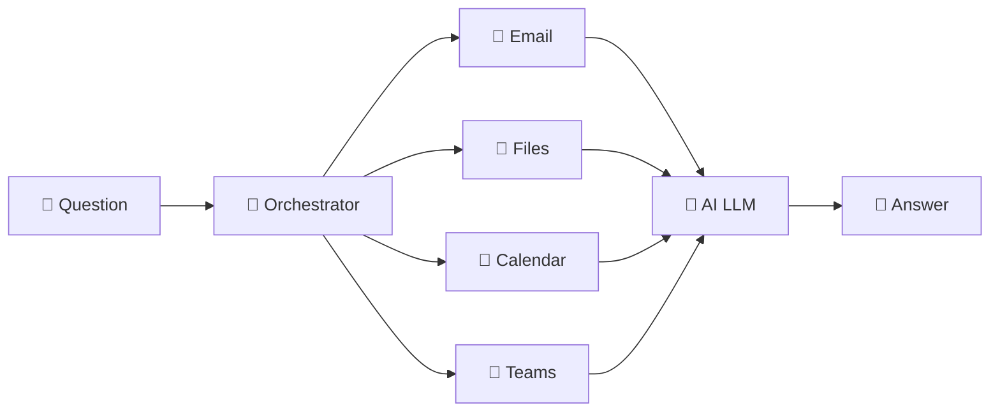

# Copilot Principles + Security & Compliance
{: .no_toc }

| Time | Duration | Student Role |
|:-----|:-----|:-----------|
| 09:40 | 20 min | 👀 Watch |

## Table of Contents
{: .no_toc .text-delta }

1. TOC
{:toc}

---

## What You'll Learn in This Module

- Understand Copilot's **orchestrator** architecture
- How context (data) determines answer quality
- The **three-layer security shield** of M365 Copilot

---

## How Does Copilot Work?

When you ask Copilot a question, you are **not** talking directly to the AI.
There's an intermediary in between — like a **traffic officer**. This is called the 'orchestrator'.

### How the Orchestrator Works

1. You ask a **question**
2. The orchestrator **decides** "What do I need to answer this?"
3. It **collects the necessary data** — emails, files, calendar, Teams conversations, etc.
4. It passes **the question + data together** to the AI (LLM)
5. The AI **generates the answer**

{: .highlight }
> **Key insight:** The AI doesn't answer alone — the orchestrator gathers the ingredients and hands them over.

---

## Different Ingredients → Different Answers

Even with the same AI, different data (ingredients) produces completely different answers.

| Situation | Question | Result |
|:-----|:-----|:-----|
| **No data** | "What were our team's sales in the second half?" | ❌ "I'm unable to access specific data to answer this." |
| **After attaching a file** | (Same question) | ✅ "Second-half sales were ₩1.23 billion, up 15% year-over-year." |

What changed is not the AI. The **ingredients** changed.

{: .tip }
> This is the core principle behind the afternoon exercise of giving your agent a 'textbook (knowledge source)'.

---

## Three-Layer Security Shield

"Is it safe to use at work?" — This is the most frequently asked question.

The short answer: **Yes, it is.** For three reasons.

### Shield ① — Data Protection

Your inputs, company documents, emails — this data is **not used to train the AI**.
It does not leave Microsoft's boundaries.

### Shield ② — Permission-Based Responses

Files you don't have access to are **invisible to Copilot too**.
That's because the orchestrator checks Microsoft Graph permissions.

### Shield ③ — Compliance Boundaries

The security policies your company already uses (Purview, DLP, information protection) **apply to Copilot as well**.
No new security system needs to be built.

| Shield | Key Point | Compared to ChatGPT |
|:------|:-----|:-------------|
| ① Data protection | Company data is not used for AI training | ChatGPT — may be used for training |
| ② Permission-based | Data outside your permissions is invisible to Copilot | ChatGPT — no permission concept |
| ③ Compliance | Existing M365 security policies apply as-is | ChatGPT — separate security setup required |

---

## Key Takeaways

1. Copilot doesn't work alone — **the orchestrator gathers the ingredients** before the AI works
2. **Good data → Good answers** — this is the principle behind 'knowledge (textbook)'
3. **Company data is safe** — protected by three security shields

---

## FAQ

| Question | Answer |
|:-----|:-----|
| What's the biggest difference between Copilot and ChatGPT? | Copilot accesses company data **securely**. ChatGPT cannot access company data and your inputs may be used for training. |
| What if the AI makes something up? | Hallucinations can occur. For important decisions, always **verify the source**. Copilot displays citations with its answers. |
| Does using Copilot at work require admin approval? | Yes. Copilot license assignment and security policy configuration is handled by IT administrators. |

---

## Reference Materials

| Resource | Link |
|:-----|:-----|
| Microsoft Copilot official docs | [learn.microsoft.com/copilot](https://learn.microsoft.com/copilot/) |
| Microsoft 365 Security & Compliance | [learn.microsoft.com/security](https://learn.microsoft.com/microsoft-365/security/) |
| Copilot Studio security guide | [learn.microsoft.com/copilot-studio/security](https://learn.microsoft.com/microsoft-copilot-studio/security-overview) |

---

Next module: [M2. Immersive vs In-context](m02-immersive-incontext)
