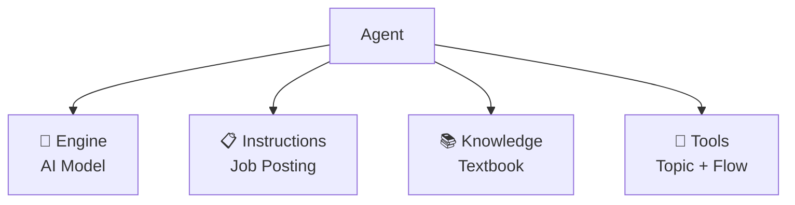

# Understanding the 4 Frameworks + Writing Your Design Document
{: .no_toc }

| Time | Duration | Student Role |
|:-----|:-----|:-----------|
| 11:15 | 30 min | 🟢 Write design doc |

## Table of Contents
{: .no_toc .text-delta }

1. TOC
{:toc}

---

## What You'll Learn in This Module

- The concept of **generative orchestration** (automatic transmission)
- The agent's **4 frameworks** (engine, instructions, knowledge, tools)
- Writing your own **agent design document**

---

## Generative Orchestration = Automatic Transmission

Copilot Studio has two modes.

| Mode | Analogy | Description |
|:-----|:-----|:-----|
| **Generative** (automatic) | Automatic transmission | AI assesses the situation and handles it on its own |
| Classic (manual) | Manual transmission | Every flow must be designed step by step |

{: .highlight }
> This course uses **generative (automatic transmission)**. It's more intuitive and lets you build agents with text alone.

---

## The 4 Frameworks of an Agent

An agent is made up of 4 components.

| Component | Role | Analogy | Module |
|:---------|:-----|:-----|:---------|
| **Engine** | Which AI is the brain? | Car engine | M5 intro |
| **Instructions** | Role, attitude, scope, principles | 📋 Job posting | M5 |
| **Knowledge** | Source material for answers | 📚 Textbook | M6 |
| **Tools** | Actions it can actually take | 🤲 Hands & feet | M7–M10 |



---

## Practice: Write Your Own Agent Design Document

Starting now, you'll create the **compass** for today.

### Choose From 3 Samples

| Sample | Target Work | Core Functions |
|:-----|:---------|:---------|
| **A. HR/Admin Assistant** | Benefits, internal policies | Auto-answers + contact lookup |
| **B. Procurement/Admin Assistant** | Purchase requests, approvals | Process guidance |
| **C. Planning/Strategy Report** | Weekly performance report | Auto-generate reports |

{: .tip }
> You don't have to use these samples — feel free to use your **actual work** as the subject!

### Using Copilot to Write the Design Document

Enter the following prompt to Copilot:

```
I'm in charge of [role]. I want to create an AI agent that automatically handles [work content].
Please write a design document in the following format:

- Agent name
- One-line purpose
- Key instructions (within 3 lines)
- Required knowledge sources
- Required tools/Flows
- Deployment channel
- Related modules
```

### Design Document Example

```
Agent name: HR Assistant
One-line purpose: Instantly answer employees' HR/Admin questions
Key instructions: Friendly dedicated HR assistant, specializing in benefits, vacation, and expenses
Required knowledge: FAQ.docx, BenefitsGuide.docx, ContactInfo.xlsx
Required tools: Contact inquiry forwarding Flow
Deployment channel: Teams + @mention
```

{: .important }
> This design document is today's **compass**. Take it out at the end of each module to check "this is what we're working on now." You'll complete it in the final module (M13).

---

## Key Takeaways

1. **Generative orchestration** = automatic transmission where AI decides on its own
2. Agent = **engine + instructions + knowledge + tools**
3. The design document is today's compass — complete it in M13

---

## FAQ

| Question | Answer |
|:-----|:-----|
| There are words in the design document I don't know | That's okay. By the end of this afternoon you'll know them all. Leave blanks and fill them in later. |
| Can I use a topic other than my actual work? | Yes! Practice is the goal. But using your actual work means you can apply it tomorrow. |
| Is it okay for Copilot to write the design document for me? | Of course. The goal is not 'creating the design document' but 'understanding the agent's structure.' |

---

## Reference Materials

| Resource | Link |
|:-----|:-----|
| Copilot Studio orchestration | [learn.microsoft.com](https://learn.microsoft.com/microsoft-copilot-studio/advanced-generative-actions) |
| Agent design guide | [learn.microsoft.com](https://learn.microsoft.com/microsoft-copilot-studio/guidance/building-agents-overview) |

---

Next module: [M5. Writing Instructions](m05-instructions)
