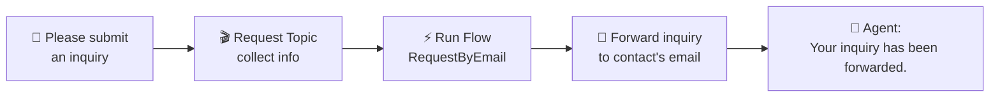

# Adding Hands & Feet — Flow + Email Forwarding
{: .no_toc }

| Time | Duration | Student Role |
|:-----|:-----|:-----------|
| 15:30 | 50 min | 🟡 Copy-paste + verify |

## Table of Contents
{: .no_toc .text-delta }

1. TOC
{:toc}

---

## What You'll Learn in This Module

- Create a **Power Automate Cloud Flow** and connect it to the agent
- See **inquiry content auto-forwarded** to the contact's email
- Understand the full connected structure of **Agent → Topic → Flow → Email**
- An agent with a connected Flow = **"conversational RPA"**

---

## From Words to Actions

Until now the agent has only **talked**.

| Stage | Before (through M6) | After (from M9) |
|:-----|:----------------|:--------------|
| User | "How many vacation days do I have?" | "Please submit an inquiry to the contact" |
| Agent | "You have 15 days." (talk only) | Topic → Flow → **Auto-forward to contact's email** (action!) |

{: .highlight }
> When a Flow is connected, the agent becomes a **conversational RPA**.

---

## Full Connected Structure



---

## Practice ①: Create a Power Automate Flow

### Flow Structure — RequestByEmail

| Item | Content |
|:-----|:-----|
| **Flow Name** | RequestByEmail |
| **Trigger** | When a flow is called from Copilot Studio |
| **Input ①** | `myRequest` (text): Inquiry content |
| **Input ②** | `mySender` (text): Requester's name |
| **Input ③** | `myEmail` (text): Contact's email address |
| **Action** | Send inquiry content to contact's email |
| **Output** | `myReturn` (text): Processing complete message |

### Step-by-Step

1. Go to [Power Automate](https://make.powerautomate.com)
2. **"Create"** → **"Instant cloud flow"**
3. Select **"When a flow is called from Copilot Studio"** trigger
4. Add input parameters: `myRequest` (text), `mySender` (text), `myEmail` (text)
5. **"+ New step"** → **"Office 365 Outlook"** → **"Send an email (V2)"**
6. To: select dynamic content `myEmail`
7. Subject: `[Inquiry Received] Inquiry from @{triggerBody()?['text_1']}`
8. Body: paste the HTML below
9. **Save the Flow**

### Email Body HTML

Copy and paste the HTML below directly into the body:

```html
<h2>📧 A new inquiry has been received</h2>
<table>
  <tr><td><b>From</b></td><td>@{triggerBody()?['text_1']}</td></tr>
  <tr><td><b>Inquiry</b></td><td>@{triggerBody()?['text']}</td></tr>
  <tr><td><b>Received at</b></td><td>@{utcNow()}</td></tr>
</table>
<p>This email was automatically forwarded by the HR Assistant agent.</p>
```

{: .note }
> You don't need to understand the HTML. **Copy-paste is the goal.**

---

## Practice ②: Create Request Topic

1. Copilot Studio → **Topics** → **"+ Add Topic"**
2. Topic name: `Request Topic`
3. **Copy-paste the instructor-provided configuration:**
   - Ask user for inquiry content
   - Confirm contact's email address (search knowledge or ask user)
   - Save to variables
   - Call RequestByEmail Flow
4. Connect Flow: select **"RequestByEmail"**
5. Map inputs:
   - `myRequest` ← User's inquiry content
   - `mySender` ← `System.User.DisplayName`
   - `myEmail` ← Contact's email address (variable)
6. **Save**

---

## Practice ③: Update Instructions

Add to the STRICT RULES in the instructions from M5:

```
- "Please submit an inquiry to the contact" and similar requests → call Request Topic
- Look up the contact's email address from the ContactInfo knowledge, and if not found, ask the user
```

---

## Final Test

1. In the test panel, type: **"Please submit an inquiry to the contact"**
2. The agent asks for inquiry content → Type **"Laptop replacement request"**
3. Agent confirms contact email → searches knowledge or asks user
4. Check **the contact's inbox** → confirm inquiry email received! 🎉
5. Click **Publish again** → Reflected in Teams

{: .important }
> After adding a Flow, you must **re-publish** for it to be reflected in the Teams agent.

---

## Key Takeaways

1. **Flow = agent's hands & feet** — extend from words to actions
2. **Email forwarding = envelope** — automatically forward inquiries to the right contact
3. **HTML is copy-paste** — no need to understand the code
4. **Must re-publish** after connecting a Flow
5. **An agent with a connected Flow is a conversational RPA**

---

## FAQ

| Question | Answer |
|:-----|:-----|
| What is Power Automate? | Microsoft's automation tool. It serves as the hands and feet of the agent. |
| Do I need to know HTML? | No. Today we only copy-paste. |
| Can other tools besides Flow be connected? | HTTP requests, custom connectors, and more are all possible. Today we focus on email integration. |
| What if the agent calls the Flow incorrectly? | Write the STRICT RULES in the instructions more clearly. Use the 3-step debugging from M5. |
| How does the agent find the contact's email? | It searches the ContactInfo.xlsx knowledge file, or asks the user directly if not found. |

---

## Reference Materials

| Resource | Link |
|:-----|:-----|
| Creating a Flow from Copilot Studio | [learn.microsoft.com](https://learn.microsoft.com/microsoft-copilot-studio/advanced-flow-create) |
| Getting started with Power Automate | [learn.microsoft.com](https://learn.microsoft.com/power-automate/getting-started) |
| Office 365 Outlook connector | [learn.microsoft.com](https://learn.microsoft.com/connectors/office365/) |

---

Next module: [M10. Conversation Logs](m10-conversation-log)
