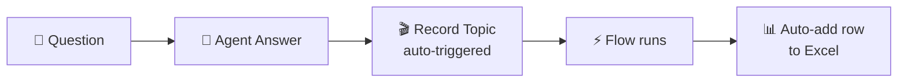

# The Agent's Diary — Save Chat Logs to Excel
{: .no_toc }

| Time | Duration | Student Role |
|:-----|:-----|:-----------|
| 16:35 | 20 min | 👀 Instructor demo |

## Table of Contents
{: .no_toc .text-delta }

1. TOC
{:toc}

---

## What You'll Learn in This Module

- The **Record Topic + Flow → Excel** auto-recording structure
- **3 reasons** why recording conversations matters (improvement, audit, analysis)
- The potential for **data-driven agent improvement**

---

## Why Record Conversations?

Automatically recording all agent conversations **in Excel** creates 3 types of value.

| Purpose | Description |
|:-----|:-----|
| **Agent improvement** | Identify frequently asked questions → reinforce knowledge |
| **Audit/Compliance** | Transparent record of who asked what, when |
| **Work analysis** | Discover actual work needs from question patterns |

---

## Conversation Logging Structure

### Excel Recording Fields

| Column | Value | Description |
|:-----|:---|:-----|
| Time | `utcNow()` | When the conversation occurred |
| User | `System.User.PrincipalName` | Who asked |
| Question | `System.Activity.Text` | User input |
| Answer | `System.Response.FormattedText` | Agent response |

### What Makes Record Topic Special

A regular Topic only runs when the user asks a specific question.
But Record Topic runs automatically **every time the AI generates a response**.

{: .highlight }
> The user doesn't even know they're being recorded. The agent is **automatically writing its own diary**.

---

## Data Usage Scenarios

The recorded data enables these types of analysis.

| Scenario | Analysis Method | Expected Outcome |
|:---------|:---------|:---------|
| **Top 10 Most Asked Questions** | Keyword classification of question column | Priority for knowledge source reinforcement |
| **Answer Failure Patterns** | Filter for "I don't know" responses | Identify gaps in the textbook |
| **Usage Trends** | Aggregate by time/day of week | Optimize service hours |
| **Per-User Overview** | Pivot analysis | Identify users needing training |

{: .tip }
> Ask Copilot "What are the top 5 most frequently asked questions in this data?" and it will **automatically analyze** for you.

---

## Key Takeaways

1. **Record Topic** = a special Topic that automatically detects every conversation
2. **Flow → Excel** = auto-records conversation content
3. Recorded data enables **agent improvement, audit, and work analysis**
4. **Automatic data analysis** is also possible with Copilot

---

## FAQ

| Question | Answer |
|:-----|:-----|
| Can I save to somewhere other than Excel? | Dataverse, SQL, SharePoint lists, etc. are all possible. Excel is the simplest. |
| Is there a row limit in Excel? | Yes. For large-scale operations, Dataverse or a database is recommended. |
| How is personal information protected? | The security policies from M1 apply. User name anonymization is also possible. |
| Can our team use this today? | Yes, once you connect the Flow + Excel, it's ready to use immediately. |

---

## Reference Materials

| Resource | Link |
|:-----|:-----|
| Copilot Studio analytics dashboard | [learn.microsoft.com](https://learn.microsoft.com/microsoft-copilot-studio/analytics-overview) |
| Power Automate Excel connector | [learn.microsoft.com](https://learn.microsoft.com/connectors/excelonlinebusiness/) |
| Agent performance monitoring | [learn.microsoft.com](https://learn.microsoft.com/microsoft-copilot-studio/analytics-sessions) |

---

Next module: [M11. AI Prompt](m11-ai-prompt)
