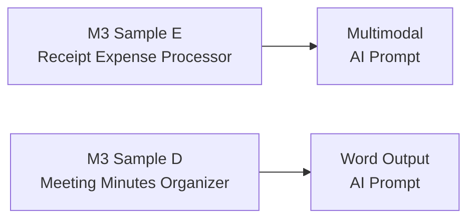

# AI Prompt — Embedding AI in a Flow
{: .no_toc }

| Time | Duration | Student Role |
|:-----|:-----|:-----------|
| 16:55 | 20 min | 👀 Instructor demo |

## Table of Contents
{: .no_toc .text-delta }

1. TOC
{:toc}

---

## What You'll Learn in This Module

- **AI Prompt** = the feature that embeds AI inside a Flow
- Distinguishing **4 types** (text, multimodal, code interpreter, Word output)
- Understanding the **internal mechanics** of the M3 samples
- Ideas for real-world application

---

## Embedding AI in a Flow

The Flow we built in M9 was a **rules machine**.
"If this input arrives, run this" — it only operates as defined.

Adding an AI Prompt turns the Flow into a **judging AI**.

| State | Flow's Nature |
|:-----|:-----------|
| **Before (M9)** | Rules machine — runs as defined |
| **After (M11)** | Judging AI — AI analyzes, generates, classifies based on the prompt |

{: .highlight }
> **With a single AI Prompt, a Flow transforms from a rules machine into a judging AI.**

---

## 4 Types of AI Prompts

| Type | What It Does | Example | M3 Sample Connection |
|:-----|:--------|:-----|:------------|
| **Text** | Generate, classify, summarize, extract | Auto-classify customer inquiries by category | — |
| **Multimodal** | Recognize images and documents | Extract amount/date from a receipt photo | Sample E (receipt) |
| **Code Interpreter** | AI writes and runs code | PDF × 10 → Excel expense report | Sample E (expense report) |
| **Word Output** | Text → auto-generate document | Meeting notes → Word report | Sample D (meeting minutes) |

---

## Type ① — Text: Auto-Classification

When a customer inquiry arrives, AI automatically classifies it by category.

**Flow Structure:**
1. Input: Customer inquiry text
2. AI Prompt: "Classify this inquiry as 'Technical Support', 'Billing', or 'General Inquiry'"
3. Output: Classification result

**Example:**

| Input | AI Classification |
|:-----|:-----------|
| "My internet isn't working" | **Technical Support** |
| "My invoice looks wrong" | **Billing** |
| "Where is the parking lot?" | **General Inquiry** |

{: .tip }
> Just change the prompt text and the classification criteria change. No code needed.

**🔗 Real-World Application:** This text type can also be used to **auto-generate response drafts**.
Example: Inquiry submitted via Forms → AI generates draft answer based on internal FAQ → Email sent to manager for review
(The full workflow is covered in M12 "Real-World Scenario")

---

## Type ② — Multimodal: Receipt Recognition

Insert a receipt photo and AI automatically extracts the amount, date, and merchant.

| Input | AI Extraction Result |
|:-----|:-----------|
| 📷 Receipt image | Amount: $45.00 |
| | Date: 2026-03-20 |
| | Merchant: Downtown Coffee |

{: .note }
> The internal engine of **"Receipt Expense Processor (Sample E)"** from M3 is exactly this multimodal AI Prompt.

---

## Type ③ — Code Interpreter

Upload 10 expense PDFs → AI automatically generates and runs code → Creates an **Excel expense report**.

- No developer needed
- AI creates and runs the code on its own
- Result: A table organized with dates, amounts, and categories

---

## Type ④ — Word Output

Input meeting notes text → AI automatically generates a **Word report**.

Auto-organized items:
- Attendees
- Discussion points
- Decisions made
- Follow-up actions

{: .note }
> This is the pro-level version of M3's **"Meeting Minutes Organizer (Sample D)"**.

---

## Connection to M3 Samples

The AI Prompts are the **internal engine** of what you experienced in M3 with Agent Builder.

---

## Key Takeaways

1. **AI Prompt** = the feature that embeds AI inside a Flow
2. **4 types:** Text, Multimodal, Code Interpreter, Word Output
3. The internal engine of M3 samples is exactly **AI Prompts**
4. No code — add AI to a Flow with **a single prompt text**

---

## FAQ

| Question | Answer |
|:-----|:-----|
| Are there extra costs for AI Prompts? | Copilot Studio licenses include AI credits. For heavy usage, check the credit consumption. |
| Does it handle documents in English well? | Yes, the latest models have excellent English document and image recognition. |
| Can I generate Word in our company format? | Specify the format in the prompt. Combined with a Word template, it gets even more precise. |
| Can I use AI Prompts without an agent? | Yes! They can also be used standalone in a Power Automate Flow. |

---

## Reference Materials

| Resource | Link |
|:-----|:-----|
| AI Prompt overview | [learn.microsoft.com](https://learn.microsoft.com/ai-builder/prompts-overview) |
| Power Automate + AI Builder | [learn.microsoft.com](https://learn.microsoft.com/ai-builder/use-in-flow-overview) |
| Multimodal prompts | [learn.microsoft.com](https://learn.microsoft.com/ai-builder/azure-openai-model-pautate) |
| Code Interpreter | [learn.microsoft.com](https://learn.microsoft.com/ai-builder/prebuilt-prompts) |

---

Next module: [M12. Future Vision](m12-future-vision)
