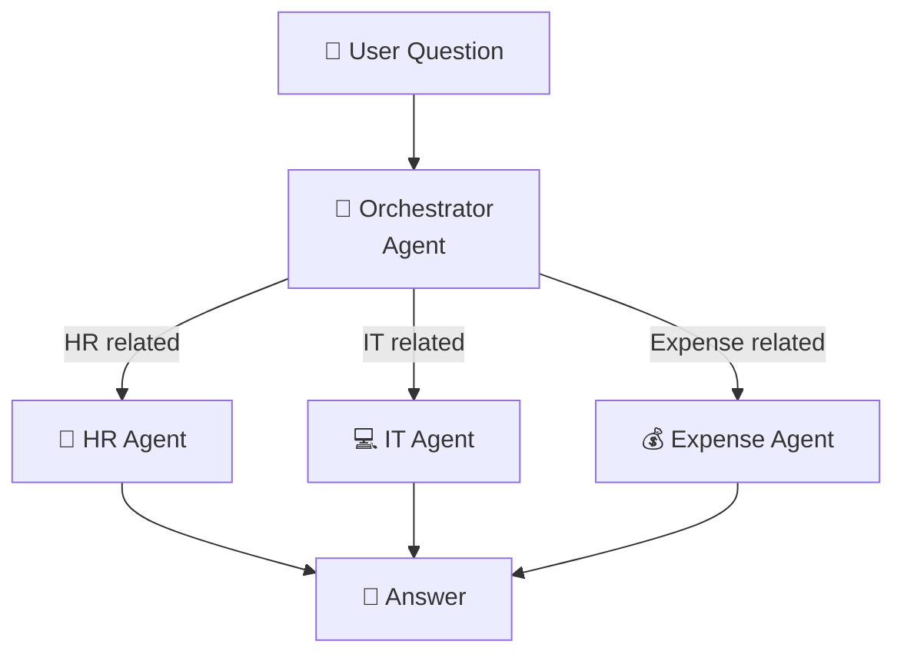
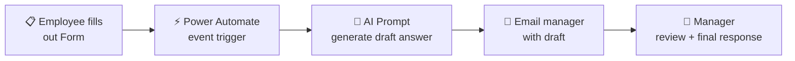

# Future Vision — Multi-Agent + Autonomous Triggers
{: .no_toc }

| Time | Duration | Student Role |
|:-----|:-----|:-----------|
| 17:15 | 15 min | 👀 Instructor demo |

## Table of Contents
{: .no_toc .text-delta }

1. TOC
{:toc}

---

## What You'll Learn in This Module

- The **multi-agent** pattern (orchestrator + specialist agents)
- How **3 types of triggers** make agents act autonomously
- The **expansion path** for the agent you built today

---

## From One Agent to a Team

It's hard for one agent to handle HR, IT, and expenses all at once.
Just as it's hard for one person to handle every department's work.

The solution is to build a **team of agents**.

---

## Multi-Agent Patterns

### Pattern 1: Orchestrator + Specialist Agents



The user talks to **one agent**, but a **team of specialists** works behind the scenes.

| Pattern | Structure | Analogy |
|:-----|:-----|:-----|
| **Orchestrator + Specialist** | Team lead identifies request → delegates to specialist → consolidates result | Team lead assigns the right person |
| **Sequential Pipeline** | Agent A → B → C in order | [Classify] → [Answer] → [Quality check] |

### Scaling Up

By creating one agent at a time and connecting them to the orchestrator,
you build an **agent organization** that covers the entire company.

{: .highlight }
> The method for creating each agent is **identical to what you learned today**.

---

## Triggers — Autonomous Agents

Until now, the agent only responded when a user **spoke to it**.
With triggers attached, the agent **moves on its own**.

| Type | Description | Analogy | Example |
|:-----|:-----|:-----|:-----|
| **Schedule-based** | Runs automatically at a set time | Employee who arrives at work every morning | Daily 9 AM news briefing |
| **Event-based** | Runs when a specific event occurs | Receptionist who picks up when the phone rings | Auto-classify when new email arrives |
| **Agent-to-agent** | Called by another agent | Cross-department work request | Multi-agent linkage |

### Schedule Trigger Example

```
Automatic execution at 9 AM every day
    ↓
Agent generates news briefing
    ↓
Auto-posted to Teams
    ↓
Information is already collected before you arrive at work
```

{: .tip }
> When a trigger is connected, the agent **starts working on its own** — before you even get to work.

---

## Real-World Scenario: Forms Inquiry → AI Draft → Manager Review

This is a scenario that came in from a real customer.
Let's see how the skills you learned today connect.

### Scenario

> "Create an inquiry form for internal use and publish it. When an employee submits an inquiry, the AI should create a **draft answer** and send it to the manager.
> The manager then reviews the draft and **handles the final response themselves**."

### Full Workflow



### What Skills Are Needed?

| Step | Technology | Module Learned |
|:-----|:-----|:-------------|
| ① Auto-start when Form is submitted | Event trigger (Forms response) | This module (M12 triggers) |
| ② Generate draft answer from inquiry | AI Prompt — text type | M11 |
| ③ Email manager with draft | Flow + Office 365 email | M9 |
| ④ Manager reviews and responds | **Human-in-the-Loop** pattern | Design principle |

### Human-in-the-Loop — The Core Design Principle of the AI Era

No matter how well the AI does, **the final decision is made by a person**.

| Pattern | Description | Risk |
|:-----|:-----|:------|
| **Fully automatic** | AI answer → sent directly to employee | ⚠️ Incorrect answers damage trust |
| **Human-in-the-Loop** ✅ | AI draft → manager review → send after approval | ✅ Quality guaranteed |

{: .important }
> AI's role is **creating drafts**, humans' role is **reviewing and making final decisions**.
> This is the safest and most effective AI collaboration pattern.

### How to Build This Scenario

1. **Microsoft Forms** — create inquiry form (title, category, details)
2. **Power Automate** — auto-trigger when Forms response arrives
3. **AI Prompt (text)** — generate draft answer based on inquiry content + internal FAQ
4. **Send email** — email the manager with original inquiry + draft answer
5. **Manager** — review and revise the draft, then respond directly

By combining **M9 (Flow + email) + M11 (AI Prompt) + M12 (trigger)** from today's learning,
this is a scenario you can **build starting tomorrow**.

---

## Do You Need Multi-Agent Right Away?

{: .note }
> **No!** First focus on running the one agent you built today well. Expand when you need to.

---

## Key Takeaways

1. **Multi-agent** = orchestrator + team of specialist agents
2. **3 trigger types** = how agents move on their own (schedule/event/agent-to-agent)
3. **Human-in-the-Loop** = AI draft + human review — the safest AI collaboration pattern
4. **All of this is possible** with what you learned today
5. Run one agent well first, then **expand when you need to**

{: .highlight }
> "From one complete agent to a team of agents — when triggers are connected, they become digital colleagues who work on their own."

---

## FAQ

| Question | Answer |
|:-----|:-----|
| Is multi-agent configuration difficult? | Connecting specialist agents from the orchestrator is just a few clicks. |
| What if a trigger malfunctions? | Check the Power Automate run history and set conditions more precisely. |
| Are there additional costs for multi-agent? | Licensing may vary based on the number of agents. Check with your admin. |
| Don't agents conflict with each other? | The orchestrator handles traffic control. With clearly written roles for each agent, they collaborate without conflict. |

---

## Reference Materials

| Resource | Link |
|:-----|:-----|
| Multi-agent overview | [learn.microsoft.com](https://learn.microsoft.com/microsoft-copilot-studio/multi-agent-overview) |
| Autonomous agent triggers | [learn.microsoft.com](https://learn.microsoft.com/microsoft-copilot-studio/advanced-triggers) |
| Copilot Studio roadmap | [learn.microsoft.com](https://learn.microsoft.com/microsoft-copilot-studio/whats-new) |

---

Next module: [M13. Complete Your Design Document](m13-design-complete)
